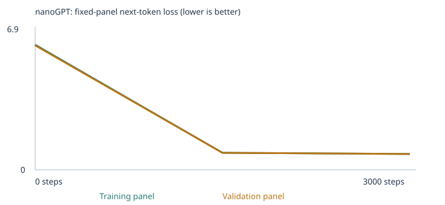
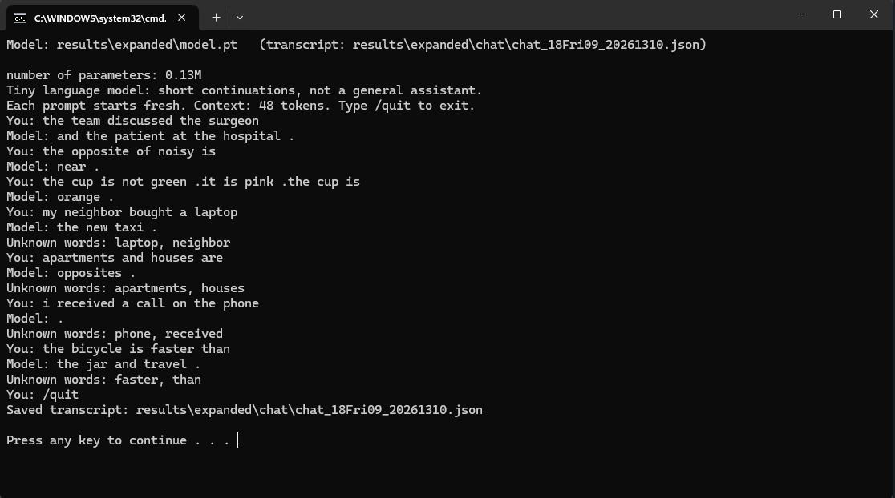

# Building a Custom LLM with nanoGPT — Class 4

Training Karpathy's nanoGPT from scratch on a word-token corpus, twice: once on the
supplied classroom sentences, once on those sentences plus teaching material I wrote for
four of the eight extension skills. Both models were tested on the same unchanged 48-case
language eval before and after training, and the second model is wired to a terminal chat.

**Result: expanding the corpus for opposites, categories, grammar and negation raised the
fixed-eval score from 20/48 to 33/48. Three of the four taught skills went from unscorable
to 3/3. Negation became scorable and stayed at 0/3, which is what I predicted.**

| Experiment | Stage | Correct / 48 | Scorable / 48 | Accuracy among scorable | Full results |
|---|---|---|---|---|---|
| Starter corpus | Untrained | 9 | 24 | 37.5% | [summary](results/starter/language_evals/untrained/eval_summary.json) · [per case](results/starter/language_evals/untrained/eval_results.csv) |
| Starter corpus | Trained | 20 | 24 | 83.3% | [summary](results/starter/language_evals/final/eval_summary.json) · [per case](results/starter/language_evals/final/eval_results.csv) |
| Expanded corpus | Untrained | 9 | 36 | 25.0% | [summary](results/expanded/language_evals/untrained/eval_summary.json) · [per case](results/expanded/language_evals/untrained/eval_results.csv) |
| Expanded corpus | Trained | **33** | 36 | **91.7%** | [summary](results/expanded/language_evals/final/eval_summary.json) · [per case](results/expanded/language_evals/final/eval_results.csv) |

The 13-case gain splits cleanly into two causes. Twelve cases changed from *unscorable* to
*scorable* because the new corpus put their words into the vocabulary; nine of those twelve
were then answered correctly, three (negation) were not. One further change had nothing to do
with vocabulary: the eight `starter_transfer` cases, which use only starter words in new word
orders, went from 4/8 to 8/8. Section 5 takes these apart.

These are public development tests that I read while writing the corpus. They measure
next-word selection on a tiny model, not general language ability, and they are not an
unseen benchmark.

## Contents

| File | What it is |
|---|---|
| [`notebooks/custom_llm_starter.ipynb`](notebooks/custom_llm_starter.ipynb) | **Experiment 1, executed** — classroom corpus, all outputs visible |
| [`notebooks/custom_llm_expanded.ipynb`](notebooks/custom_llm_expanded.ipynb) | **Experiment 2, executed** — classroom corpus + `corpus/` files |
| [`custom_llm.ipynb`](custom_llm.ipynb) | The notebook as run (course starter + my prediction cell), unexecuted |
| [`results/starter/`](results/starter/) · [`results/expanded/`](results/expanded/) | Every file each run produced: config, corpus, split, vocabulary report, tokenization, inspection, loss history, samples, temperature comparison, `checkpoint.json`, `model.pt`, `model_untrained.pt`, both eval result sets, the results ZIP |
| [`results/*/rerun_final/`](results/expanded/rerun_final/) · [`rerun_untrained/`](results/expanded/rerun_untrained/) | The same evals rerun from the saved `.pt` files with `run_evals.py` — identical hashes and scores |
| [`corpus/`](corpus/) | The four teaching files for experiment 2 (generated by [`make_corpus.py`](make_corpus.py)) |
| [`check_corpus.py`](check_corpus.py) · [`results/corpus_check_expanded.txt`](results/corpus_check_expanded.txt) | Leakage check and vocabulary simulation run before training |
| [`evals/language_evals.json`](evals/language_evals.json) · [`run_evals.py`](run_evals.py) | The unchanged 48-case suite and its runner (course-supplied, hash-pinned) |
| [`chat.py`](chat.py) · [`chat.bat`](chat.bat) | Terminal chat with the trained model, and a double-click launcher |
| [`results/expanded/chat/`](results/expanded/chat/) | 7 real chat turns ([transcript](results/expanded/chat/chat_18Fri09_20261310.json)) and the [screenshot](results/expanded/chat/chat_screenshot.png) |
| [`results/expanded/viewer_customer.png`](results/expanded/viewer_customer.png) · [`viewer_kitten.png`](results/expanded/viewer_kitten.png) | Embedding viewer loaded with the expanded `checkpoint.json` |
| [`nanogpt_model.py`](nanogpt_model.py) | Karpathy's `model.py`, unmodified, pinned by SHA-256 |
| [`PREDICTION.md`](PREDICTION.md) | My choices and prediction, committed before training ([commit](https://github.com/adamsamazin/custom-llm-nanogpt/commit/50e1853)) |

## 1. My choices and prediction

### The three choices

**Corpus.** Experiment 1 used the supplied classroom generator alone, with `corpus/`
empty. Experiment 2 kept those sentences and added four UTF-8 text files I wrote for the
extension skills *opposites*, *categories and analogies*, *grammar*, and *negation* — 2,228
new unique passages. All four are my own text (generated from word lists and sentence
frames by `make_corpus.py`, the same way the notebook builds its classroom sentences), so
there is nothing to get permission for and the files are committed in full. No PDFs were
used, so there were no extraction warnings; `corpus_manifest.json` for the expanded run
shows four files, 2,457 passages, zero ignored files and zero warnings.

I chose opposites, categories and grammar because each is a short, local pattern — a frame
plus a word pair — that a 2-block, 64-number model can plausibly memorize from varied
examples. I added negation as a deliberate stretch: it requires copying the corrected word
from an earlier sentence, which I expected this model to fail at, and I wanted one category
where I could separate "the words are now in the vocabulary" from "the model learned the
pattern".

**Training steps: 3,000** for both experiments. A 10-step run first confirmed the pipeline.
Holding the budget fixed keeps the corpus as the only difference between the two required
runs; a valid experiment isolates one variable.

**Learning rate: 0.001** for both, with the notebook's 100-step warmup and cosine decay to
10% of the peak. This is the default and I kept it deliberately: the model has ~112k
parameters and the classroom vocabulary is 136 words, so tuning the rate would have
confounded the comparison for little gain. A much larger rate risks the loss diverging (the
notebook halts on a non-finite loss); a much smaller one would leave the model closer to
its random start after 3,000 steps.

### What I expected, then what happened

The full pre-registered text is in [`PREDICTION.md`](PREDICTION.md) and in cell 2 of both
executed notebooks. Scorecard:

| Prediction | Observed | Verdict |
|---|---|---|
| Validation loss falls from ln(136) = 4.93 to roughly 1.0–1.4 | 4.93 → **0.71** | Direction right, magnitude wrong — the templates are more predictable than I estimated |
| Training ≈ validation loss (same templates) | 0.68 vs 0.71 | Right |
| Grammatical template sentences by step 1,500; domain-consistent by 3,000 | All four step-1,500 samples are already complete, domain-consistent templates | Faster than predicted |
| `customer` neighbours become client, buyer, shopper, consumer, subscriber | shopper 0.978, client 0.977, buyer 0.977, subscriber 0.971, consumer 0.970 | Right |
| First update ≈ learning rate 1e-5 | weight moved −1.0e-5 | Right |
| Exp. 1 evals: starter ≈ 16/16, transfer ≈ 4/8, extension 0/24 unscorable | 16/16, 4/8, 0/24 with 0 scorable | Right |
| Exp. 2: coverage rises to ~36; opposites/categories/grammar ≥ 6/9; negation 0–1/3 | 36 scorable; **9/9**; **0/3** | Right |
| Starter scores hold, maybe slightly diluted | Starter 16/16 held; transfer **rose** to 8/8 | Missed the transfer gain entirely |

## 2. The runs

Both experiments ran on this PC's CPU (Windows 11, PyTorch 2.6.0+cu124, `DEVICE = "cpu"`)
by executing the notebook top to bottom with `jupyter nbconvert --execute`, which is Run All
without a browser. Neither run was interrupted. Config files: [starter](results/starter/config.json),
[expanded](results/expanded/config.json); training summaries: [starter](results/starter/training_summary.json),
[expanded](results/expanded/training_summary.json).

| | Starter corpus | Expanded corpus |
|---|---|---|
| Run id | `20260918T195932_894729Z` | `20260918T200059_522836Z` |
| Completed steps / elapsed | 3,000 / 16.4 s | 3,000 / 19.7 s |
| Parameters | 111,872 | 135,360 |
| Vocabulary (incl. `<UNK>`, `<BOS>`, `<EOS>`) | 136 | 503 |
| Word types retained of cap 509 | 133 of 133 (0 omitted) | 500 of 500 (0 omitted) |
| Unique passages after dedup | 4,592 | 6,820 |
| Train / validation passages | 4,132 / 460 | 6,138 / 682 |
| Training / held-out unknown-token rate | 0.00% / 0.00% | 0.00% / 0.03% |
| Reserved classroom passages (contain a test prefix) | 160 | 160 |
| Eval panels (fixed) | 20 train, 20 validation | 20 train, 20 validation |

Why 3,000 steps takes 16 seconds: the network is 0.11M parameters and a batch is 32
passages of at most 48 tokens. Each step is a few hundred thousand multiply-adds. The
parameter count differs between runs only because the embedding table grew from 136×64 to
503×64 (and its tied output layer with it).

Vocabulary reports: [starter](results/starter/vocabulary_report.json),
[expanded](results/expanded/vocabulary_report.json). The 509-type cap never bit: the
classroom corpus has only 133 word types, and I sized the teaching files so the merged
corpus has 500. Every word the twelve targeted eval cases need (prompt words *and* all four
answer choices) is in the expanded vocabulary; `check_corpus.py` verified that before
training and the eval runner confirmed it after (12 of 24 extension cases scorable).

**What the held-out split can and cannot test.** The split is by deduplicated passage, not
by source file, and validation sentences come from the same eight templates as training.
Held-out loss therefore measures whether the model can predict *new combinations of known
slots in known frames*. It does not measure generalization to new sentence structures or
new documents; the `starter_transfer` evals are the closest thing to that in this project.

## 3. Evidence from experiment 1 (starter corpus)

### Loss


| Step | Training-panel loss | Validation-panel loss |
|---|---|---|
| 0 | 4.926 | 4.928 |
| 1,500 | 0.682 | 0.718 |
| 3,000 | 0.678 | 0.706 |

Source: [`history.json`](results/starter/history.json), [`training.csv`](results/starter/training.csv).
Both panels are fixed sets of at most 20 passages, and the loss is the mean over every
non-padding next-token target in the panel. They are small estimates, not full-corpus
measurements. The step-0 value is ln(136) = 4.91 to two decimals: a randomly initialized
model spreads its probability almost uniformly over the 136-word vocabulary.

Almost all of the improvement happened before the halfway checkpoint. Between steps 1,500
and 3,000, validation loss moved from 0.718 to 0.706 — the model had already learned the
templates, and the remaining loss is the genuine uncertainty in the slots: given "the team
discussed the", any of 48 nouns can follow.

### Samples at three stages (temperature 0.8, seed 2026, same four draws each time)

Full files: [step 0](results/starter/samples/step_0000.txt), [step 1,500](results/starter/samples/step_1500.txt),
[step 3,000](results/starter/samples/step_3000.txt).

Untrained (first sample, truncated): `mentioned travel system mentioned instructor and client credit yesterday patient purchase brand course offering market bank …` — 32 tokens of vocabulary words with no structure.

Step 1,500:
```
a review of taste helped us understand the important orange .
we learned about the different physician during a discussion of treatment .
today the bank focused on return and the important investment .
we learned about the different merchandise during a discussion of quality .
```

Step 3,000:
```
a review of patient helped us understand the important dentist .
we learned about the different physician during a discussion of treatment .
today the store focused on service and the important client .
we learned about the different merchandise during a discussion of quality .
```

Every step-1,500 sample is already a complete classroom template with domain-consistent
slots (taste/orange, bank/return/investment). The visible change from 1,500 to 3,000 is
small: the first sample swapped a fruit sentence for a medical one, the third swapped
banking for shopping, the second and fourth are identical. This matches the loss curve.
What did *not* change is also worth saying: the model never produces a sentence outside
the eight frames, because it has never seen one.

### One word, from text to ID to 64 numbers

From [`tokenization.json`](results/starter/tokenization.json), the first training passage is
`today the school focused on lesson and the local professor .` The tokenizer lowercases
and splits on words and punctuation, then looks each token up in the vocabulary built
from training text only:

```
<BOS> today the  school focused on lesson and the  local professor .  <EOS>
  1    121  118   101    42    74   61   7   118   63     88     3    2
```

Each ID is a row number in the 136×64 embedding table — an address, not a quantity. `the`
is ID 118 both times it appears. `customer` is ID 28. From [`inspection.json`](results/starter/inspection.json),
row 28 started as 64 small random numbers, `[-0.0576, -0.0048, 0.0426, 0.0193, 0.0156, …]`,
and finished training as `[0.0366, -0.0182, 0.1330, 0.1060, 0.0630, …]`. Nothing about the
ID changed; every one of the 64 numbers did.

### One gradient and one weight update

The notebook records the very first update to coordinate 0 of `customer`'s embedding:

| | Value |
|---|---|
| Weight before | −0.0575919 |
| Gradient of the loss w.r.t. this weight | +0.0006926 |
| Learning rate at step 0 (warmup: 0.001 × 1/100) | 0.00001 |
| Weight after | −0.0576019 |

The weight moved by −0.0000100: the negative of the gradient's sign, times the learning
rate. That is not gradient descent's "learning rate × gradient", which would be −6.9e-9.
AdamW divides the gradient by a running estimate of its own magnitude, and on the first
step that ratio is ±1, so the first move is exactly ±learning-rate regardless of how big the
gradient was. Later steps blend momentum, the adaptive scale, and a weight-decay pull
toward zero.

### Next-token probabilities before and after

For the prefix `the customer`, top-5 next-token probabilities:

| Before training | After training |
|---|---|
| customer 0.016, bus 0.011, educator 0.010, us 0.010, application 0.010 | reviewed 0.178, recommended 0.171, ordered 0.169, selected 0.163, compared 0.160 |

Before: a near-uniform smear (1/136 = 0.0074) with random ripples. After: all of the mass
sits on the six verbs that follow "the customer" in the one classroom frame that starts
that way (`the {customer} {verb} the {product} after checking the price .`), split roughly
equally because the corpus uses them equally.

### Attention

The notebook computes head 1 of block 1's attention weights for `<BOS> the customer`,
using the trained query/key projections and the causal mask:

```
<BOS>     → [1.00, –,    –   ]
the       → [0.61, 0.39, –   ]
customer  → [0.49, 0.42, 0.09]
```

Each row is where that position looks. Row 3 says that when computing the representation
at `customer`, this head mixes 49% of `<BOS>`, 42% of `the`, and only 9% of `customer`
itself. Positions never receive weight from anything to their right — the upper triangle
is masked to −∞ before the softmax — so no prediction can peek at the token it is
predicting. This is one head of eight (2 blocks × 4 heads); it is a mechanism, not a
summary of what the model "thinks".

### Temperature (inference only; no weights change)

[`temperature_comparison.json`](results/starter/temperature_comparison.json), same seed for each temperature:

| T | Samples |
|---|---|
| 0.3 | `a review of patient helped us understand the important dentist .` / `we learned about the different physician during a discussion of treatment .` / `the different train was mentioned in the travel report yesterday .` / `we learned about the different merchandise during a discussion of quality .` |
| 0.8 | same as 0.3 except sample 3: `today the store focused on service and the important client .` |
| 1.2 | identical to 0.8 |

Temperature divides the logits before the softmax: T < 1 sharpens the distribution toward
the top choice, T > 1 flattens it. On this corpus it barely matters, and the reason is
informative: once the model has committed to a frame, the next-token distribution is so
peaked (the place after "at the" is 98% one word) that even flattening it at T = 1.2 rarely
flips a draw. The expanded-corpus model behaves differently — see section 4.

### Embedding neighbours (cosine, all 64 dimensions)

[`neighbors.json`](results/starter/neighbors.json), computed by [`neighbors.py`](neighbors.py):

| Word | Nearest 5 before training | Nearest 5 after training |
|---|---|---|
| customer | bus 0.21, educator 0.20, helped 0.20, bank 0.20, risk 0.20 | shopper 0.98, client 0.98, buyer 0.98, subscriber 0.97, consumer 0.97 |
| mango | different 0.30, product 0.21, consumer 0.20, system 0.20, bank 0.19 | peach 0.97, banana 0.97, orange 0.96, pear 0.96, apple 0.96 |
| surgeon | local 0.31, route 0.29, checking 0.29, selected 0.29, our 0.27 | dentist 0.96, physician 0.96, nurse 0.96, doctor 0.96, therapist 0.95 |

Before training, similarities of ~0.2–0.3 between random 64-vectors are noise. After
training, the six nouns of each domain sit almost on top of each other (cosine > 0.95).
That is not the model discovering that a shopper is like a customer. Those six words
appear in exactly the same slots of exactly the same frames with exactly the same context
words, so the loss is minimized by giving them nearly the same vector. Human meaning did
not enter the model; co-occurrence did.

The embedding viewer projects the 64 dimensions to 3 with PCA, which for the expanded
checkpoint keeps 27.9% of the variance (the viewer reports this figure). Two points close
in the 3D view can be far apart in the 61 dimensions that were discarded; the cosine
neighbours above use all 64 and are the numbers to trust. The viewer's own "closest
vectors" panel agrees with `neighbors.py` to three decimals
([customer screenshot](results/expanded/viewer_customer.png)).

## 4. Evidence from experiment 2 (expanded corpus)



| Step | Training-panel loss | Validation-panel loss |
|---|---|---|
| 0 | 6.241 | 6.207 |
| 1,500 | 0.852 | 0.850 |
| 3,000 | 0.790 | 0.793 |

Source: [`history.json`](results/expanded/history.json). The untrained loss is higher than
in experiment 1 because ln(503) = 6.22: a bigger vocabulary means a bigger uniform guess.
The final loss is also higher (0.79 vs 0.71) and that comparison means little — the panels
contain different passages from a differently shaped corpus, and the teaching sentences
have more free slots per template than the classroom ones. Losses across corpora are not a
ranking.

Samples ([step 0](results/expanded/samples/step_0000.txt), [1,500](results/expanded/samples/step_1500.txt),
[3,000](results/expanded/samples/step_3000.txt)): the untrained draw is again word salad
(`two professor understand car brand gold room far duck route duckling tuna frog …`). All
four step-1,500 and step-3,000 samples are classroom templates, e.g. `the customer compared
the product after checking the price .` — none of the four default draws landed in a
teaching sentence, which is consistent with the classroom passages being 67% of the
training set. The temperature comparison did surface them:

| T | Samples ([file](results/expanded/temperature_comparison.json)) |
|---|---|
| 0.3 | four clean classroom templates |
| 0.8 | four clean classroom templates |
| 1.2 | `two birds are ready .` / `we learned about the important application during a discussion of code .` / `our school has a question about the new teacher and product is a loan .` / `the shopper ordered the package after checking the price .` |

At T = 1.2 the flattened distribution let a grammar sentence through (`two birds are ready .`
is a well-formed teaching-frame sentence that does not appear verbatim in any corpus file;
the model composed it from the `{plural subject} are {adjective}` frame) and also produced a
splice: `… the new teacher and product is a loan .`, a classroom frame that wandered into a
categories frame at `is a`. With a richer corpus, temperature has something to reveal.

Inspection for this run ([`inspection.json`](results/expanded/inspection.json)): `customer`
is now ID 107 (IDs are alphabetical positions, so they change whenever the vocabulary
does — another reminder that the ID carries no meaning). First update: before −0.0203447,
gradient +0.0018429, learning rate 1e-5, after −0.0203547, again a move of exactly −1e-5.
After training, `the customer` → reviewed 0.188, compared 0.179, ordered 0.174,
recommended 0.164, selected 0.143.

Neighbours ([`neighbors.json`](results/expanded/neighbors.json)):

| Word | After training |
|---|---|
| customer | client 0.97, consumer 0.97, subscriber 0.97, buyer 0.97, shopper 0.97 |
| walked | waited 0.88, talked 0.85, played 0.85, jumped 0.84, cooked 0.63 |
| cold | cool 0.71, dry 0.70, quiet 0.61, dirty 0.59, open 0.55 |
| kitten | puppy 0.86, **carrot 0.73, salmon 0.71, robin 0.70**, apple 0.54 |
| not | very 0.56, missing 0.45, wide 0.43, this 0.40, empty 0.36 |

`walked` clusters with the other past-tense verbs, and `cold` with other second-halves of
opposite pairs. `kitten` is the useful one: its neighbours are puppy (sensible) and then
carrot, salmon and robin — a vegetable, a fish and a bird. Those are the six words I taught
through the same distinctive set of sentence frames ("the small X is …", "the X in the
garden is …"), because they are the six tested facts. The model grouped them by *which
templates they appear in*, not by what they are. A human judgment of meaning would never
put kitten next to carrot; a co-occurrence model does, and the 3D viewer shows it too:


## 5. The fixed language evals

The suite is [`evals/language_evals.json`](evals/language_evals.json) (48 cases; SHA-256 of
the loaded suite `1d7c503f…` in every summary file), run by [`run_evals.py`](run_evals.py).
Neither file was changed; the notebook verifies their hashes at startup. Each case is a
prompt, four single-word choices, and an answer. **Only the prompt enters the model.** The
runner reads the next-token probabilities, and the case scores 1 if the correct choice has
the highest probability of the four, else 0; ties score 0. Cases with any prompt or choice
word outside the vocabulary are marked `out_of_vocabulary`, are not scored, and count as 0
in the all-case rate — so a model cannot look better by having a smaller vocabulary. The
runner also saves a free continuation (temperature 0.8, per-case seed, 24 tokens) that is
**not** scored. The runner checks the model's weight hash before and after and raises if
anything changed.

### By group and category, trained models

| Group / category | Cases | Starter trained | Expanded trained |
|---|---|---|---|
| **starter_patterns** | 16 | 16 (16 scorable) | 16 (16 scorable) |
| · domain_context | 8 | 8 | 8 |
| · domain_place | 8 | 8 | 8 |
| **starter_transfer** (new_wording) | 8 | 4 (8 scorable) | **8** (8 scorable) |
| **extend_corpus** | 24 | 0 (0 scorable) | **9** (12 scorable) |
| · grammar | 3 | 0 (0) | **3** (3) |
| · opposites | 3 | 0 (0) | **3** (3) |
| · categories_and_analogies | 3 | 0 (0) | **3** (3) |
| · negation | 3 | 0 (0) | **0** (3) |
| · everyday_knowledge, reference, sequence, spatial_relations | 12 | 0 (0) | 0 (0) — not taught, still unscorable |

Untrained baselines: the starter model scored 9/48 (37.5% of 24 scorable), the expanded
untrained model 9/48 (25.0% of 36 scorable — exactly the chance rate for four choices).
The untrained "correct" cases are different ones in each run
([starter](results/starter/language_evals/untrained/eval_results.json),
[expanded](results/expanded/language_evals/untrained/eval_results.json)) and are coin flips.

### What each change was: vocabulary, learned pattern, or both

**Starter patterns, 16/16 in both runs — learned pattern.** These prompts are prefixes of
classroom frames. The 160 generated sentences containing one of the 16 reserved prefixes
were removed before the split ([`eval_separation.json`](results/starter/eval_separation.json)),
so the model never saw e.g. `the report about the surgeon explains the` followed by
anything. It still assigns `patient` 0.234 against ~0.001 for the distractors, because it
saw `surgeon` next to `patient`, `health`, `care` and `treatment` in seven other frames.
The `domain_place` cases are even sharper (`… at the` → store 0.987) because the place is
fully determined by the domain.

**Starter transfer, 4/8 → 8/8 — learned pattern, not vocabulary.** Every word in these
eight prompts was in the starter vocabulary; the sentence structures are new (`our hospital
discussed the nurse and the`). The starter model failed four of them, and the per-case
file shows why: on the failures, all four choices had probability 0.000 — the model had
seen `discussed the {noun} and the` only in one frame where the next word is a context
noun, and with the rest of the prompt scrambled it put its mass elsewhere entirely. The
expanded model gets all eight, with modest probabilities (student 0.032, support 0.034,
delivery 0.043). I did not predict this. My best explanation is that the teaching files
contain the same function words (`the`, `and`, `is`, `at`) in many more sentence
structures, so the model's representation of "what follows `and the`" became less tied to
one template. It is a real, measured improvement in using old words in new orders, and it
argues that corpus *variety* helps transfer even when the topic is unrelated.

**Grammar, opposites, categories: unscorable → 3/3 each — both.** The new words made the
cases scorable, and the model then answered them with confidence: `one bird` → is 0.524 vs
0.000 for are/were/am; `the opposite of hot is` → cold 0.871; `a robin is a bird . a salmon
is a` → fish 0.786. The opposites result is the one I find most convincing, because of how
the corpus was written: the frame `the opposite of X is Y` appears in training only with
pairs that are *not* tested (big/small, wet/dry, …), and the tested pairs hot/cold,
empty/full, noisy/quiet appear only in other frames (`hot and cold are opposites`, `the
soup is hot but the snow is cold`, `when it is not hot it is cold`). To score, the model
had to combine a frame learned from some pairs with an association learned from other
sentences. The closest case was noisy → quiet 0.566 vs late 0.145; *late* is a plausible
confusion because `late` also appears as the second half of a pair (early/late) in the
same frames.

**Negation, unscorable → 0/3 — vocabulary only.** All three cases became scorable and all
three failed, and the failures are informative:

| Case | Prompt ends | Expected | Model's ranking |
|---|---|---|---|
| lang_31 | `… the box is not red . it is blue . the box is` | blue | yellow 0.198, green 0.112, red 0.057, **blue 0.047** |
| lang_32 | `… ava did not buy tea . she bought milk . ava bought` | milk | rice 0.053, **milk 0.043**, tea 0.030, bread 0.026 |
| lang_33 | `… the door is not open . it is closed . the door is` | closed | **open 0.209**, closed 0.006, wide 0.002, missing 0.000 |

The model has learned that a colour follows `the box is` and a food follows `ava bought` —
the probability mass is on the right *category* — but it does not pick the word that the
context supplies. In lang_33 it does the opposite: it copies `open`, the word that was
explicitly negated. That is what a model does when it has learned "a word that appeared
earlier after `the door is` is likely to appear again" but not "…unless it was preceded by
`not`". With 2 blocks and 64 dimensions, 615 unique negation stories and 3,000 steps, the
copy heuristic won. This is exactly the separation I built the category to show: coverage
went from 0 to 3, accuracy stayed at chance or below.

**Not taught: 12 cases still unscorable.** Everyday knowledge, reference, sequence and
spatial relations were outside my extension, and their prompt words (umbrella, maya,
breakfast, lamp …) are absent from both vocabularies. No amount of extra training on
either corpus could change that.

### Free continuations vs. multiple-choice score

Selecting the best of four is not the same as writing. Some pairs from the expanded trained
run ([full file](results/expanded/language_evals/final/eval_results.json)):

| Prompt | Scored choice | Free continuation |
|---|---|---|
| `the report about the customer explains the` | service ✓ | `order in detail .` |
| `the opposite of noisy is` | quiet ✓ | `quiet .` |
| `yesterday she` | walked ✓ | `walked at the river .` |
| `the box is not red . it is blue . the box is` | yellow ✗ | `orange .` |
| `yesterday our office discussed the platform and the` | update ✓ | `field item cooked the park today .` |

The last row is the important one: the model *ranked* `update` correctly (0.152) yet
*sampled* a nonsense string, because sampling at T = 0.8 from a flat distribution over a
strange prefix can go anywhere. A correct four-choice pick shows a narrow learned
preference; it does not show fluent generation. The chat transcript in section 6 has the
mirror-image case, where the top choice lost a random draw.

### Keeping the exam out of the textbook

The evals live in `evals/`, the corpus in `corpus/`, and the runner never trains. Checks,
in order:

1. The notebook removes every generated classroom sentence containing one of the 48
   prompts before the split and before the vocabulary is built. 160 passages were removed
   in both runs, all for the 16 `starter_patterns` cases
   ([`eval_separation.json`](results/expanded/eval_separation.json)).
2. The notebook rejects any imported file containing a prompt, and rejects a corpus folder
   that overlaps `evals/` or the project root.
3. Before training I ran [`check_corpus.py`](check_corpus.py) on the four files
   ([output](results/corpus_check_expanded.txt)): it applies the same normalized contiguous
   prompt match, simulates the vocabulary build, and additionally flags *answer-bearing*
   phrases that the notebook's check would not catch (`a salmon is a fish`, `ava bought
   milk`, `not open . it is closed`, …). The final corpus has zero prompt matches and zero
   flagged phrases.
4. `make_corpus.py` enforces the stricter rule I set myself: the tested pair or fact never
   appears inside the test's own frame in either direction, and near-copies are banned
   (no `did not buy tea` for anyone; `box` and `door` never appear in a colour or state
   story). Two-word prompts (`one bird`, `the dogs`, `yesterday she`) never occur at all.
5. Chat transcripts and eval outputs are under `results/`, which is not a training input.

What these checks cannot do: they match strings, not meaning. My grammar file teaches
`the cats are` and the test asks `the dogs`; my opposites file has `the opposite of big is
small` and the test asks about hot. That is deliberate — the test items and the teaching
items must differ, but the underlying skill must be the same or there would be nothing to
learn. A reader who thinks the frames are too close should look at the negation category,
where the frames are equally close and the model still failed.

Because I read the 48 cases while deciding what to teach, these scores are a development
benchmark. A claim about unseen generalization would need a second set of tests that
never influenced the corpus, and I have not made one.

## 6. Chat with the trained model

The interface is [`chat.py`](chat.py) (course-supplied): it loads `model.pt` and its saved
vocabulary, takes a prompt, tokenizes it, samples up to 24 tokens at temperature 0.8, and
prints the result. Each prompt starts a fresh context — there is no conversation memory —
and the context window is 48 tokens. Replies are continuations, not answers; the model was
never instruction-trained. Nothing about the model changes during chat, and chat text is
never added to the corpus.

**Model used:** `results/expanded/model.pt` from run `20260918T200059_522836Z` (3,000
steps, expanded corpus), weight hash `f2d72372f8bb…`, the same hash recorded in the eval
summaries.

**Launch:**

```
python chat.py --model results/expanded/model.pt --transcript results/expanded/chat/my_chat.json
```

or double-click [`chat.bat`](chat.bat) on Windows, which runs that command with a
timestamped transcript name. Type `/quit` to stop; the transcript is written on exit.

**Evidence:** [screenshot](results/expanded/chat/chat_screenshot.png) ·
[transcript](results/expanded/chat/chat_18Fri09_20261310.json) (7 turns). The full session:

| You | Model | Note |
|---|---|---|
| `the team discussed the surgeon` | `and the patient at the hospital .` | Starter frame, correct domain words |
| `the opposite of noisy is` | `near .` | The scored eval ranked *quiet* first (0.566) — see below |
| `the cup is not green .it is pink .the cup is` | `orange .` | Expected failure: a colour, but not the one in context |
| `my neighbor bought a laptop` | `the new taxi .` — *Unknown words: laptop, neighbor* | Two `<UNK>` tokens; the model continues from `bought a` |
| `apartments and houses are` | `opposites .` — *Unknown words: apartments, houses* | Learned frame applied to two unknown words |
| `i received a call on the phone` | `.` — *Unknown words: phone, received* | Immediate end-of-sequence |
| `the bicycle is faster than` | `the jar and travel .` — *Unknown words: faster, than* | Mixed classroom and teaching vocabulary |



**The limitation, concretely.** Turn 2 answered `near` even though this same model, on this
same prompt, ranks `quiet` above `loud`, `round` and `late` in the eval. Both facts are
true at once: the eval reads the probability table, while chat *samples* from it — a 57%
favourite loses roughly two draws in five at temperature 0.8, and `near` is another
second-half-of-a-pair word that the model has learned belongs in this slot. Turn 5 is the
same mechanism from the other side: the model has learned that `X and Y are` is usually
followed by `opposites`, and it says so about two words it has no representation for at
all. A word-level model this small predicts *which kind of word* comes next far better
than *which word*.

The notebook's own section-10 chat cell also ran once during each experiment
([starter](results/starter/chat_transcript.json), [expanded](results/expanded/chat_transcript.json)),
prompt `the customer` → `ordered the merchandise after checking the price .`

## 7. What I learned

**The corpus, what it can teach, and what is missing.** The classroom corpus is 4,592
distinct sentences generated from eight frames and eight domains. It can teach the frames,
which nouns share a domain, and which place goes with which domain; that is all it
contains, so that is all the model can learn. It cannot teach `is`, `not`, `she` or any
fact about the world, because none of those words appear in it — the untrained starter
model had 24 of 48 eval cases unscorable for exactly that reason. Holding out 10% of
passages is how I check that the model learned the *pattern* rather than memorizing the
passages: the validation panel contains sentences the model never trained on, and its loss
tracked the training loss within 0.03 throughout. Because validation shares the templates,
that is the only thing it checks.

**Token, ID, vector, embedding.** A token is a piece of text the tokenizer produced —
`professor`, or `.`. Its ID is its row number in the vocabulary, 88 for `professor` in
experiment 1 — an arbitrary integer that would be different if the vocabulary were sorted
differently, and was (customer went from 28 to 107 between runs). The vector is the 64
numbers stored in that row of the embedding table, and the embedding table is the whole
136×64 (later 503×64) matrix of them. The ID never changes during training; the vector is
what gradient descent edits.

**Why it is a neural network, and how the weights changed.** The model is a stack of
learned matrices with nonlinearities between them (GELU inside each block's feed-forward
layer, softmax inside attention), and every one of its 111,872 numbers was set by the same
procedure: compute a prediction, measure the loss, compute the gradient of the loss with
respect to every weight by backpropagation, and move each weight a small step to reduce
it. I can point at one instance: at step 0, coordinate 0 of `customer`'s embedding was
−0.0575919, PyTorch computed a gradient of +0.0006926, and AdamW moved it to −0.0576019.
Three thousand such steps, each using 32 passages, took the validation loss from 4.93 to
0.71.

**What attention combines, and why it cannot look ahead.** At each position, attention
computes a weighted average of the representations at that position and every earlier one,
with weights the model learned to produce from its query and key projections — for
`customer` in `<BOS> the customer`, head 1 of block 1 took 49% from `<BOS>`, 42% from `the`,
9% from itself. That is how the network gives a word a representation that depends on its
context rather than only on its embedding row. It cannot use later positions because the
attention scores for every position to the right are set to −∞ before the softmax, which
makes their weights exactly zero. If it could, predicting the next token would be trivial
and the model would learn nothing.

**From probabilities to text, and what temperature does.** The final layer turns the last
position's representation into one score per vocabulary word; softmax turns the scores into
probabilities that sum to 1; the generator draws one word from that distribution, appends
it, and repeats until `<EOS>` or the length limit. Temperature divides the scores before
the softmax. At 0.3 the distribution sharpens toward the single best word; at 1.2 it
flattens, which is how `two birds are ready .` and the spliced `… product is a loan .`
appeared. No weight changed during any of this — the same `model.pt` produced all three
temperature sets and the whole chat session, and the runner verifies the weight hash before
and after.

**Did the evidence support my prediction, and what can I conclude?** The shape was right
and the numbers were conservative. Loss fell far more than I predicted (0.71 vs 1.0–1.4),
templates appeared earlier than predicted, and the extension categories landed exactly
where I said: three skills learned, negation not. The one thing I missed — transfer going
from 4/8 to 8/8 — is the most interesting result, because it is an improvement on cases
whose words never changed. What I can honestly conclude: this model learned the
co-occurrence structure of its corpus extremely well, learned three frame-plus-pair
patterns from ~2,000 teaching sentences, and did not learn to use a negation across a
sentence boundary. What I cannot conclude: anything about language understanding. The
`kitten`/`carrot` neighbourhood is the reminder that its "meaning" is template membership.

## 8. One limitation and my next experiment

**Limitation:** the negation failure, and specifically its direction. On `the door is not
open . it is closed . the door is`, the model gave `open` 0.209 and `closed` 0.006. It
copied the negated word. The teaching stories all have the same shape — `X is not A . it
is B . X is B` — and the model needed to learn that after `X is` the right word is the one
that followed `it is`, not the one that followed `X is not`. Copying the first thing that
followed `X is` is the simpler rule and it is what a 2-layer model found. I also want to
name the format constraint that made this category hard to teach at all: the notebook's
loader splits text into separate passages at every `. ` sentence boundary, so a
three-sentence story written normally becomes three unrelated one-sentence passages. I
wrote the negation stories with no space after the mid-story periods (`. it` → `.it`) so
the loader keeps each story whole; the tokenizer produces the same tokens either way, and
the leakage check still sees them. It works, but it means every other student's negation
corpus is probably shredded silently, and it is a good example of a pipeline detail that
decides what a model can learn before training even starts.

**Next experiment:** keep everything fixed and change one thing — the negation corpus.
Add stories where the negated word is *also* the answer in a different position (`the cup
is blue . it is not green . the cup is blue`) and stories with two corrections, so that
"copy the word after `X is`" stops working and only "copy the word after `it is`" survives.
Prediction: negation moves from 0/3 to 1–2/3 if the model can represent the `not` cue in
64 dimensions, and stays at 0/3 if the bottleneck is depth rather than data. A second,
cheaper probe: rerun the expanded corpus at 6,000 steps (a few seconds on this hardware)
to check whether the failure is under-training; I predict it is not, because validation
loss had flattened by step 1,500.

## 9. Reproduce and inspect

**Install.** Python 3.12, then `pip install -r requirements.txt` (PyTorch, pypdf, Jupyter).
CPU is enough; both runs took under 20 seconds.

**Run an experiment.** Open `custom_llm.ipynb` in Jupyter or Colab and Run All; or
headless: `jupyter nbconvert --to notebook --execute --ExecutePreprocessor.timeout=-1
custom_llm.ipynb --output notebooks/my_run.ipynb`. With `corpus/` empty you reproduce
experiment 1; with the four `corpus/*.txt` files present you reproduce experiment 2. Seeds
are fixed, so on CPU the numbers should match the ones in this README. Each run writes
`llm_runs/<timestamp>/` and a ZIP; `results/` holds curated copies of mine.

**Regenerate the teaching corpus:** `python make_corpus.py` (seeded; produces byte-identical
files), then `python check_corpus.py` to see the leakage check and vocabulary simulation.

**Rerun the evals on the saved weights:**

```
python run_evals.py --model results/expanded/model.pt --output results/my_rerun_final
python run_evals.py --model results/expanded/model_untrained.pt --stage untrained --output results/my_rerun_untrained
```

The summaries record the suite hash and the model hash, so you can confirm you scored the
same tests on the same weights I did (`rerun_*` folders show my own reruns doing exactly
that).

**Chat:** `python chat.py --model results/expanded/model.pt --transcript results/my_chat.json`
or `chat.bat`.

**Embedding viewer:** open `embedding-viewer.html` locally, click *Open your checkpoint*,
choose `results/expanded/checkpoint.json` (or the starter one). `checkpoint.json` contains
the initial and final embedding tables only; `model.pt` has the full network.

Notebook outputs were not cleared. Both executed notebooks are under 100 KB and render on
GitHub.

---

Course starter, eval suite, runner and chat script: [pepealonso95/custom-llm](https://github.com/pepealonso95/custom-llm).
nanoGPT: [karpathy/nanoGPT](https://github.com/karpathy/nanoGPT), MIT license in `NANOGPT_LICENSE`.
